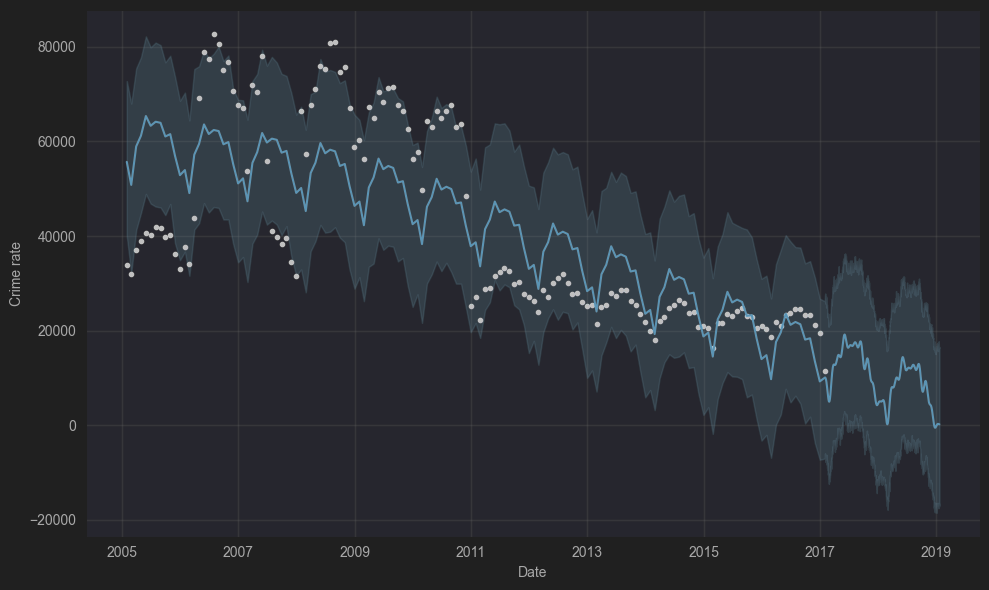

# Chicago Crime Data Analysis

A comprehensive analysis of Chicago crime data from 2005 to 2017, featuring data preprocessing, exploratory data analysis, visualization, and predictive forecasting using Facebook's Prophet model.

## 📊 Project Overview

This project analyzes historical crime data from Chicago to identify trends, patterns, and forecast future crime rates. The analysis covers a 13-year period (2005-2017) and includes over 6 million crime records.

## 🛠️ Technologies Used

- **Python 3.x**
- **pandas** - Data manipulation and analysis
- **numpy** - Numerical computing
- **seaborn** - Statistical data visualization
- **matplotlib** - Plotting and visualization
- **Prophet** - Time series forecasting by Facebook

## 📁 Dataset

The project uses three CSV files containing Chicago crime data:
- `Chicago_Crimes_2005_to_2007.csv`
- `Chicago_Crimes_2008_to_2011.csv`
- `Chicago_Crimes_2012_to_2017.csv`

## 📈 Analysis Features

### Data Preprocessing
- **Data Integration**: Combines three separate datasets spanning 2005-2017
- **Data Cleaning**: Removes unnecessary columns and handles missing values
- **Date Processing**: Converts date strings to datetime objects for time series analysis

### Exploratory Data Analysis
- **Missing Value Analysis**: Heatmap visualization of null values
- **Crime Type Distribution**: Analysis of most common crime types
- **Location Analysis**: Identification of crime hotspot locations
- **Temporal Patterns**: Crime trends by year, month, and quarter

### Visualizations
- Crime count distribution by type (top 15 categories)
- Location-based crime analysis (top 15 locations)
- Time series plots showing:
  - Annual crime trends
  - Monthly crime patterns
  - Quarterly crime cycles

### Predictive Modeling
- **Prophet Time Series Forecasting**: 
  - Trains on monthly crime aggregates
  - Generates 720-period (2 years) future forecasts
  - Decomposes trends into seasonal components

## 📊 Key Insights

The analysis reveals:
- **Crime Types**: Most common crimes include theft, battery, criminal damage, and narcotics violations
- **Temporal Trends**: Seasonal patterns and long-term trends in crime rates
- **Location Patterns**: Identification of high-crime areas and venue types

## 🔮 Forecasting

The Prophet model provides:
- Long-term crime rate predictions
- Seasonal decomposition showing:
  - Overall trend
  - Weekly patterns
  - Yearly seasonality
- Uncertainty intervals for predictions

## 📋 Usage

Simply run the script cells in order. The analysis will:
1. Load and combine the three datasets
2. Perform data cleaning and preprocessing
3. Generate exploratory visualizations
4. Create time series forecasts
5. Display trend components and predictions

## 🤝 Contributing

Feel free to fork this project and submit pull requests for improvements or additional analysis features.

## 📄 License

This project is open source and available under the MIT License.
