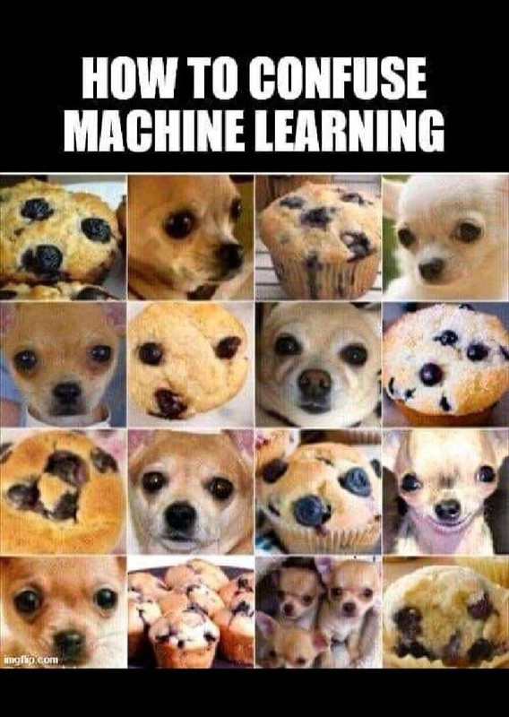

# 🐕 vs 🧁 Chihuahua or Blueberry Muffin? CNN Classifier

A deep learning image classification project inspired by the famous internet meme "How to Confuse Machine Learning" - distinguishing between adorable chihuahuas and delicious blueberry muffins using TensorFlow/Keras.



*The inspiration behind this project - can you tell which is which?*

## 🎯 Project Overview

This project tackles one of the internet's most beloved visual challenges: correctly identifying whether an image shows a chihuahua or a blueberry muffin. The striking visual similarity between fluffy chihuahuas and textured muffin tops makes this a genuinely challenging computer vision problem that demonstrates the complexities of image classification.

### Features
- **Custom CNN Architecture**: 5-layer convolutional neural network with progressive feature extraction
- **Data Augmentation**: Random flips, rotations, translations, and zoom for better generalization
- **GPU Support**: Optimized for GPU training with TensorFlow
- **Interactive Prediction**: Upload your own images to test the model
- **Early Stopping**: Automatic training termination at 85% accuracy threshold
- **Comprehensive Visualization**: Training progress plots and augmentation demos


## 📁 Dataset Structure

```
project_root/
├── data/
│   ├── train/
│   │   ├── chihuahua/          # Training chihuahua images
│   │   └── muffin/             # Training muffin images
│   └── validation/
│       ├── chihuahua/          # Validation chihuahua images
│       └── muffin/             # Validation muffin images
├── Model.ipynb                 # Main notebook file
└── README.md
```


## 🧠 Model Architecture

### CNN Structure
```
Input (300x300x3)
├── Rescaling (1./255)
├── Conv2D (16 filters, 3x3) + ReLU
├── MaxPooling2D (2x2)
├── Conv2D (32 filters, 3x3) + ReLU  
├── MaxPooling2D (2x2)
├── Conv2D (64 filters, 3x3) + ReLU
├── MaxPooling2D (2x2)
├── Conv2D (64 filters, 3x3) + ReLU
├── MaxPooling2D (2x2)
├── Conv2D (128 filters, 3x3) + ReLU
├── MaxPooling2D (2x2)
├── Flatten
├── Dense (256 units) + ReLU
└── Dense (1 unit) + Sigmoid
```

### Data Augmentation Pipeline
- **Random Horizontal Flip**: Mirrors images for variety
- **Random Rotation**: ±20% rotation with nearest-fill
- **Random Translation**: ±20% shift in both directions
- **Random Zoom**: ±20% zoom with nearest-fill

## 📊 Training Configuration

- **Image Size**: 300x300 pixels
- **Batch Size**: 32
- **Optimizer**: RMSprop (learning_rate=1e-4)
- **Loss Function**: Binary Crossentropy
- **Early Stopping**: Triggers at 85% train + validation accuracy
- **Data Pipeline**: Cached, shuffled, and prefetched for optimal performance

## 🎮 Usage

### 1. Data Preparation
Organize your images in the specified directory structure with training and validation splits.

### 2. Training
Run the cells sequentially in the notebook:
```python
# The model will automatically stop training when reaching 85% accuracy
history = model_with_aug.fit(
    train_dataset_final,
    epochs=EPOCHS,
    validation_data=validation_dataset_final,
    callbacks=[EarlyStoppingCallback()]
)
```

### 3. Interactive Prediction
Use the built-in file upload widget to test your own images:
```python
# Upload images through the interactive widget
# Results will display: "image.jpg is a chihuahua" or "image.jpg is a muffin"
```

## 📈 Results & Visualization

The project includes comprehensive visualization tools:
- **Sample Display**: 4x4 grid of random training samples
- **Augmentation Demo**: Before/after comparison of data augmentation
- **Training Plots**: Accuracy and loss curves for both training and validation

## 🎯 Model Performance

- **Target Accuracy**: ~85% (training slightly below, validation slightly above )
- **Early Stopping**: Prevents overfitting
- **Binary Classification**: 0.5 threshold (>0.5 = muffin, ≤0.5 = chihuahua)


## 🤔 Why This Problem is Challenging

1. **Visual Similarity**: Both subjects share similar textures, colors, and rounded shapes
2. **Lighting Variations**: Different lighting conditions affect appearance
3. **Pose Variations**: Chihuahuas in various positions vs muffins from different angles
4. **Background Noise**: Cluttered backgrounds can confuse the model
5. **Limited Data**: Smaller datasets make generalization difficult

## 🏆 Fun Facts

- This meme became popular around 2016 and remains a classic example of AI challenges
- The problem demonstrates the difference between human intuition and machine learning
- Similar visual confusion exists with other pairs: bagels vs beagles, ice cream vs dogs

## 🤝 Contributing

Feel free to contribute by:
- Adding more training data
- Implementing suggested improvements
- Creating new evaluation metrics
- Optimizing the model architecture

## 📄 License

This project is open source and available under the MIT License.

## 🙏 Acknowledgments

- Inspired by the viral "How to Confuse Machine Learning" meme
- TensorFlow team for the excellent deep learning framework
- The internet for providing endless chihuahua and muffin images

